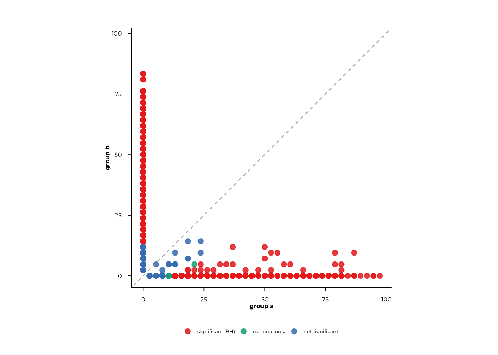
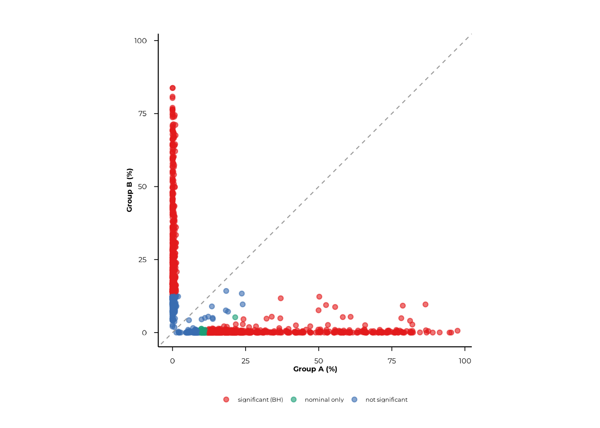
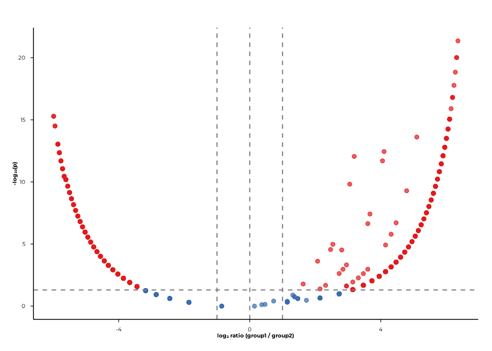
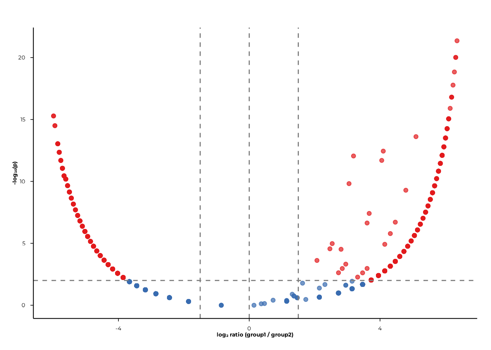
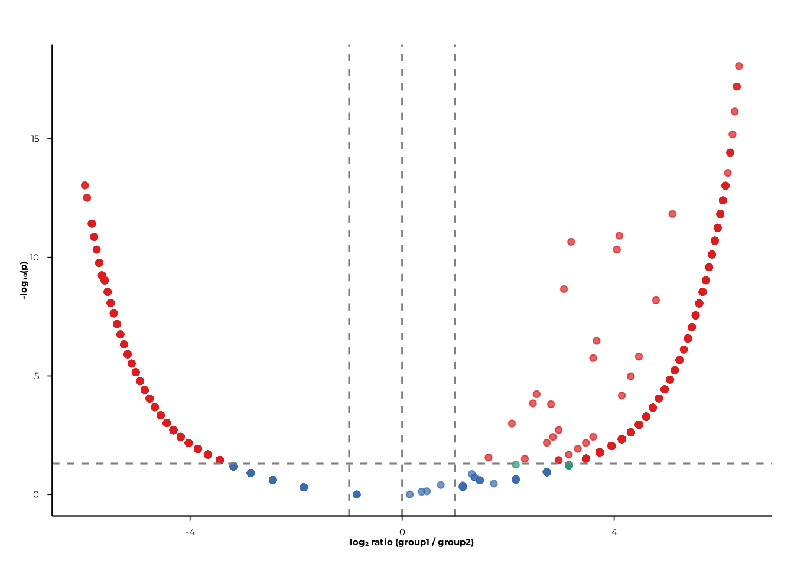

# Prevalence of Presence (POP) Analysis in PhIP-seq

## Overview

POP (Prevalence Of Presence) measures how often each feature is detected
across the samples in a group. For each `(rank, feature, group pair)`
the analysis asks: does the fraction of samples carrying this feature
differ between the two groups?

This vignette walks through the complete POP workflow in **phiper**:

1.  Computing prevalence and p-values with
    [`compute_pop()`](https://polymerase3.github.io/phiper/reference/compute_pop.md)
2.  Visualising results as scatter plots with
    [`scatter_static()`](https://polymerase3.github.io/phiper/reference/scatter_static.md)
    and
    [`scatter_interactive()`](https://polymerase3.github.io/phiper/reference/scatter_interactive.md)
3.  Volcano plots with
    [`volcano_static()`](https://polymerase3.github.io/phiper/reference/volcano_static.md)
    and
    [`volcano_interactive()`](https://polymerase3.github.io/phiper/reference/volcano_interactive.md)

------------------------------------------------------------------------

## Setup

``` r

library(phiper)
```

Load the bundled example dataset. It contains two patient groups (`A`,
`B`) measured at two timepoints (`T1`, `T2`) across 1 000 simulated
peptides.

``` r

pd <- load_example_data()
#> [09:33:45] INFO  Constructing <phip_data> object
#>                  -> create_data()
#> [09:33:45] INFO  Fetching peptide metadata library via get_peptide_library()
#> [09:33:45] INFO  Retrieving peptide metadata into DuckDB cache
#>                  -> get_peptide_library(force_refresh = FALSE)
#> [09:33:45] INFO  Opened DuckDB connection
#>                    - cache dir:
#>                      /home/runner/.cache/R/phiperio/peptide_meta/phip_cache.duckdb
#>                    - table: peptide_meta
#> [09:33:45] OK    Using cached download (SHA-256 match)
#> [09:33:48] OK    Download complete and loaded into R
#> [09:33:53] INFO  Importing sanitized metadata into DuckDB cache...
#> [09:33:55] OK    peptide_meta table created in DuckDB cache
#> [09:33:55] OK    Retrieving peptide metadata into DuckDB cache - done
#>                  -> elapsed: 9.878s
#> [09:33:55] OK    Peptide metadata acquired
#> [09:33:55] INFO  Validating <phip_data>
#>                  -> validate_phip_data()
#> [09:33:55] INFO  Checking structural requirements (shape & mandatory columns)
#> [09:33:55] INFO  Checking outcome family availability (exist / fold_change /
#>                  raw_counts)
#> [09:33:55] INFO  Checking collisions with reserved names
#>                    - subject_id, sample_id, timepoint, peptide_id, exist,
#>                      fold_change, counts_input, counts_hit
#> [09:33:55] INFO  Ensuring all columns are atomic (no list-cols)
#> [09:33:55] INFO  Checking key uniqueness
#> [09:33:55] INFO  Validating value ranges & types for outcomes
#> [09:33:55] INFO  Assessing sparsity (NA/zero prevalence vs threshold)
#>                    - warn threshold: 50%
#> [09:33:55] INFO  Checking peptide_id coverage against peptide_library
#> [09:33:55] INFO  Checking full grid completeness (peptide * sample)
#> [09:33:55] OK    Validating <phip_data> - done
#>                  -> elapsed: 0.679s
#> [09:33:55] OK    Constructing <phip_data> object - done
#>                  -> elapsed: 10.56s
pd
#> ── <phip_data> ───────────────────────────────────────────────────────────────── 
#> 
#> counts (first 5 rows): 
#> # A tibble: 5 × 9
#>   sample_id subject_id group timepoint peptide_id exist counts_control
#>   <chr>     <chr>      <chr> <chr>     <chr>      <int>          <int>
#> 1 A_T1_1    1          A     T1        10003          1              5
#> 2 A_T1_1    1          A     T1        10017          1             37
#> 3 A_T1_1    1          A     T1        10023          1             11
#> 4 A_T1_1    1          A     T1        10062          1              0
#> 5 B_T1_1    1          B     T1        10087          1              1
#> # ℹ 2 more variables: counts_hits <int>, fold_change <dbl>
#> 
#> table size: 78,200 rows x 9 columns
#> 
#> peptide library preview (first 5 rows): 
#> # A tibble: 5 × 8
#>   peptide_id Fullname                    species genus family order class common
#>   <chr>      <chr>                       <chr>   <chr> <chr>  <chr> <chr> <chr> 
#> 1 agilent_1  Chromodomain-helicase-DNA-… Homo s… Homo  Homin… Prim… Mamm… Human 
#> 2 agilent_2  integral membrane protein   Mycoba… Myco… Mycob… Myco… Acti… NA    
#> 3 agilent_3  hypothetical protein (6/16… Mycoba… Myco… Mycob… Myco… Acti… NA    
#> 4 agilent_4  envelope protein (5/8) & a… Orthof… Orth… Flavi… Amar… Flas… JEV   
#> 5 agilent_5  Myosin-7 & beta-myosin hea… Homo s… Homo  Homin… Prim… Mamm… Human 
#> ... plus 36 more columns
#> 
#> library size: 357,190 rows x 44 columns
#> 
#> meta flags: 
#>   con:            <duckdb_connection>
#>   longitudinal:   TRUE
#>   exist:          TRUE
#>   fold_change:    TRUE
#>   raw_counts:     FALSE
#>   extra_cols:     group, counts_control, counts_hits
#>   peptide_con:    <duckdb_connection>
#>   materialise_table: TRUE
#>   finalizer_env:  <environment>
#>   full_cross:     FALSE
```

> **Note.** The example data are entirely simulated and have no
> biological meaning. They exist solely to demonstrate the API.

------------------------------------------------------------------------

## Computing prevalence: `compute_pop()`

### Unpaired design — group comparison

The workhorse function is
[`compute_pop()`](https://polymerase3.github.io/phiper/reference/compute_pop.md).
Supply a `phip_data` object, the rank(s) at which prevalence should be
aggregated, and the binary grouping column(s).

``` r

pop_group <- compute_pop(
  pd,
  rank_cols  = "peptide_id",
  group_cols = "group"
)
#> [09:33:56] INFO  compute_pop
#> [09:33:56] INFO  compute_pop
#>                    - ranks : peptide_id
#>                    - group_cols: group
#>                    - exist_col : exist
#>                    - pop_k_min : 1
#>                    - paired : FALSE
#> [09:33:56] INFO  ranks resolved
#>                    - available: peptide_id
#> [09:33:56] INFO  computing cohort sizes and validating binary group_cols
#> [09:33:56] INFO  computing presence per sample via k-of-n rule
#> [09:33:56] INFO  counting present samples per feature (pop, unpaired)
#> [09:33:56] INFO  building pairwise comparisons
#> [09:33:58] OK    materialized; computing Fisher p-values
#>                    - table: ph_pop_20260519_093356
#> [09:33:59] OK    done (compute_pop, unpaired)
#>                    - rows : 1950
#>                    - ranks : peptide_id
#>                    - k_min : 1
#> [09:33:59] OK    compute_pop - done
#>                  -> elapsed: 3.272s
```

The result is a plain `data.frame` with one row per
`(rank, feature, group pair)`:

``` r

head(pop_group)
#>         rank feature group_col group1 n1 N1     prop1 percent1 group2 n2 N2
#> 1 peptide_id   10003     group      A 31 38 0.8157895 81.57895      B  0 42
#> 2 peptide_id   10017     group      A  6 38 0.1578947 15.78947      B  0 42
#> 3 peptide_id   10023     group      A 29 38 0.7631579 76.31579      B  0 42
#> 4 peptide_id   10062     group      A 11 38 0.2894737 28.94737      B  0 42
#> 5 peptide_id   10087     group      A  0 38 0.0000000  0.00000      B  8 42
#> 6 peptide_id   10100     group      A  0 38 0.0000000  0.00000      B 10 42
#>       prop2 percent2       ratio delta_ratio        p_raw n_peptides
#> 1 0.0000000  0.00000 68.52631579   33.263158 8.819969e-16          1
#> 2 0.0000000  0.00000 13.26315789    5.631579 9.186952e-03          1
#> 3 0.0000000  0.00000 64.10526316   31.052632 3.123739e-14          1
#> 4 0.0000000  0.00000 24.31578947   11.157895 1.148463e-04          1
#> 5 0.1904762 19.04762  0.06907895   -6.238095 5.758809e-03          1
#> 6 0.2380952 23.80952  0.05526316   -8.047619 1.180799e-03          1
```

### What’s in the output?

| Column | Description |
|----|----|
| `rank` | Rank at which the feature is defined (e.g. `"peptide_id"`) |
| `feature` | Feature identifier |
| `group_col` | Name of the grouping column |
| `group1`, `group2` | The two group labels being compared |
| `n1`, `N1` | Positives and total samples in group 1 |
| `prop1`, `percent1` | Prevalence in group 1 (proportion and percentage) |
| `n2`, `N2` | Positives and total samples in group 2 |
| `prop2`, `percent2` | Prevalence in group 2 |
| `ratio` | `prop1 / prop2` (with small-sample epsilon correction) |
| `delta_ratio` | Signed fold-change: `prop1/prop2 − 1` (or its negative) |
| `p_raw` | Fisher’s exact test p-value (unpaired) |
| `n_peptides` | Number of peptides contributing to this feature |

``` r

names(pop_group)
#>  [1] "rank"        "feature"     "group_col"   "group1"      "n1"         
#>  [6] "N1"          "prop1"       "percent1"    "group2"      "n2"         
#> [11] "N2"          "prop2"       "percent2"    "ratio"       "delta_ratio"
#> [16] "p_raw"       "n_peptides"
nrow(pop_group)
#> [1] 1950
```

### Multiple group columns

Pass a character vector to `group_cols` to test several grouping
variables in one call.

``` r

pop_multi <- compute_pop(
  pd,
  rank_cols  = "peptide_id",
  group_cols = c("group", "timepoint")
)
#> [09:33:59] INFO  compute_pop
#> [09:33:59] INFO  compute_pop
#>                    - ranks : peptide_id
#>                    - group_cols: group, timepoint
#>                    - exist_col : exist
#>                    - pop_k_min : 1
#>                    - paired : FALSE
#> [09:33:59] INFO  ranks resolved
#>                    - available: peptide_id
#> [09:33:59] INFO  computing cohort sizes and validating binary group_cols
#> [09:34:00] INFO  computing presence per sample via k-of-n rule
#> [09:34:00] INFO  counting present samples per feature (pop, unpaired)
#> [09:34:00] INFO  building pairwise comparisons
#> [09:34:03] OK    materialized; computing Fisher p-values
#>                    - table: ph_pop_20260519_093400
#> [09:34:05] OK    done (compute_pop, unpaired)
#>                    - rows : 3900
#>                    - ranks : peptide_id
#>                    - k_min : 1
#> [09:34:05] OK    compute_pop - done
#>                  -> elapsed: 5.451s

# One block of rows per group column
table(pop_multi$group_col)
#> 
#>     group timepoint 
#>      1950      1950
```

### Multiple ranks

`rank_cols` accepts any column present in the peptide library. Pass
`"peptide_id"` for peptide-level results, or taxonomic rank columns
(e.g. `"family"`, `"genus"`) for higher-level aggregation.

> **Note on this toy example.** The synthetic peptides do not map to
> real library annotations, so all higher-rank columns are empty. In a
> real PhIP-seq experiment, `family`- and `genus`-level rows reflect the
> taxonomic breadth of each patient’s reactivity.

``` r

pop_tax <- compute_pop(
  pd,
  rank_cols  = c("peptide_id", "family", "genus"),
  group_cols = "group"
)
table(pop_tax$rank)
```

### k-of-n presence threshold

By default a sample is called positive for a feature if at least one of
its contributing peptides is present (`pop_k_min = 1`). Raise this
threshold to require, say, at least two peptides before calling a sample
positive — useful for filtering out singleton hits.

``` r

pop_k2 <- compute_pop(
  pd,
  rank_cols  = "peptide_id",
  group_cols = "group",
  pop_k_min  = 2L
)
#> [09:34:05] INFO  compute_pop
#> [09:34:05] INFO  compute_pop
#>                    - ranks : peptide_id
#>                    - group_cols: group
#>                    - exist_col : exist
#>                    - pop_k_min : 2
#>                    - paired : FALSE
#> [09:34:05] INFO  ranks resolved
#>                    - available: peptide_id
#> [09:34:05] INFO  computing cohort sizes and validating binary group_cols
#> [09:34:05] INFO  computing presence per sample via k-of-n rule
#> [09:34:05] INFO  counting present samples per feature (pop, unpaired)
#> [09:34:05] INFO  building pairwise comparisons
#> [09:34:07] OK    materialized; computing Fisher p-values
#>                    - table: ph_pop_20260519_093405
#> [09:34:07] OK    done (compute_pop, unpaired)
#>                    - rows : 0
#>                    - ranks :
#>                    - k_min : 2
#> [09:34:07] OK    compute_pop - done
#>                  -> elapsed: 2.52s

# Higher k_min → fewer positives
mean(pop_k2$n1) < mean(pop_group$n1)
#> [1] NA
```

------------------------------------------------------------------------

## Paired design — timepoint comparison

When the same subjects are measured at two timepoints, the paired design
uses **McNemar’s exact binomial test** instead of Fisher’s exact test,
which is more powerful because it accounts for within-subject
correlation.

Set `paired` to the name of the column that links samples from the same
subject across timepoints.

``` r

pop_paired <- compute_pop(
  pd,
  rank_cols  = "peptide_id",
  group_cols = "timepoint",
  paired     = "subject_id"
)
#> [09:34:07] INFO  compute_pop
#> [09:34:07] INFO  compute_pop
#>                    - ranks : peptide_id
#>                    - group_cols: timepoint
#>                    - exist_col : exist
#>                    - pop_k_min : 1
#>                    - paired : subject_id
#> [09:34:07] INFO  ranks resolved
#>                    - available: peptide_id
#> [09:34:07] INFO  computing cohort sizes and validating binary group_cols
#> [09:34:08] INFO  computing presence per sample via k-of-n rule
#> [09:34:08] INFO  paired design: running McNemar exact (binomial)
#> [09:34:10] OK    done (compute_pop, paired)
#>                    - rows : 1950
#>                    - ranks : peptide_id
#>                    - k_min : 1
#> [09:34:10] OK    compute_pop - done
#>                  -> elapsed: 2.767s

head(pop_paired)
#>         rank feature group_col group1 n1 N1     prop1 percent1 group2 n2 N2
#> 1 peptide_id   10003 timepoint     T1 16 18 0.8888889 88.88889     T2 14 18
#> 2 peptide_id   10017 timepoint     T1  2 18 0.1111111 11.11111     T2  2 18
#> 3 peptide_id   10023 timepoint     T1 16 18 0.8888889 88.88889     T2 13 18
#> 4 peptide_id   10062 timepoint     T1  4 18 0.2222222 22.22222     T2  7 18
#> 5 peptide_id   10087 timepoint     T1  4 19 0.2105263 21.05263     T2  2 19
#> 6 peptide_id   10100 timepoint     T1  2 19 0.1052632 10.52632     T2  8 19
#>       prop2 percent2   p_raw n_peptides
#> 1 0.7777778 77.77778 0.50000          1
#> 2 0.1111111 11.11111      NA          1
#> 3 0.7222222 72.22222 0.25000          1
#> 4 0.3888889 38.88889 0.25000          1
#> 5 0.1052632 10.52632 0.62500          1
#> 6 0.4210526 42.10526 0.03125          1
```

The paired output does not include `ratio` or `delta_ratio` — the test
statistic is the McNemar discordant-pair ratio, which is reflected in
`p_raw`.

``` r

names(pop_paired)
#>  [1] "rank"       "feature"    "group_col"  "group1"     "n1"        
#>  [6] "N1"         "prop1"      "percent1"   "group2"     "n2"        
#> [11] "N2"         "prop2"      "percent2"   "p_raw"      "n_peptides"
```

------------------------------------------------------------------------

## Scatter plots

Scatter plots compare the prevalence of every feature in group 1
(x-axis) against group 2 (y-axis). Points on the diagonal represent
features with equal prevalence across groups; deviations indicate
differential carriage.

### `scatter_static()` — ggplot2

The simplest call takes the
[`compute_pop()`](https://polymerase3.github.io/phiper/reference/compute_pop.md)
result directly. Coloring is determined automatically from BH-corrected
p-values: `"significant (BH)"`, `"nominal only"`, `"not significant"`.

``` r

scatter_static(pop_group)
```



Use `pair` to restrict the plot to a specific group contrast and
`xlab`/`ylab` to label the axes.

``` r

scatter_static(
  pop_group,
  pair  = c("A", "B"),
  xlab  = "Group A (%)",
  ylab  = "Group B (%)",
  alpha = 0.05
)
```


Pass `rank` to display a single rank when the result contains multiple
ranks.

``` r

scatter_static(pop_tax, rank = "family", pair = c("A", "B"))
```

Graphical parameters are passed via `...`:

| Parameter          | Default | Effect                                |
|--------------------|---------|---------------------------------------|
| `point_size`       | 2       | Point diameter                        |
| `point_alpha`      | 0.85    | Point opacity                         |
| `jitter_width_pp`  | 0       | Horizontal jitter (percentage points) |
| `jitter_height_pp` | 0       | Vertical jitter (percentage points)   |
| `font_size`        | 12      | Base font size                        |

``` r

scatter_static(
  pop_group,
  pair             = c("A", "B"),
  xlab             = "Group A (%)",
  ylab             = "Group B (%)",
  point_size       = 1.5,
  point_alpha      = 0.6,
  jitter_width_pp  = 0.5,
  jitter_height_pp = 0.5
)
```



> **`color_by`** —
> [`scatter_static()`](https://polymerase3.github.io/phiper/reference/scatter_static.md)
> also accepts a `color_by` named vector
> (e.g. `c("species" = "Staphylococcus aureus")`) to highlight points by
> peptide-library metadata. This requires a real peptide library with
> matching annotations and is not demonstrated here.

### `scatter_interactive()` — plotly

The interactive version mirrors the static API and returns a plotly
widget suitable for HTML reports and Shiny dashboards. Hovering over a
point shows its feature identifier, raw counts, prevalence percentages,
and p-values.

``` r

scatter_interactive(
  pop_group,
  pair  = c("A", "B"),
  xlab  = "Group A (%)",
  ylab  = "Group B (%)",
  alpha = 0.05
)
```

An optional `background_df` argument lets you overlay a second set of
points (e.g. all peptides from a different comparison) as a grey
reference layer:

``` r

scatter_interactive(
  pop_group,
  pair            = c("A", "B"),
  background_df   = pop_multi[pop_multi$group_col == "timepoint", ],
  show_background = TRUE,
  background_name = "timepoint background"
)
```

------------------------------------------------------------------------

## Volcano plots

Volcano plots display **log₂ ratio** (x-axis) against **−log₁₀(p)**
(y-axis), making it easy to spot features with both large effect sizes
and small p-values.

### `volcano_static()` — ggplot2

``` r

volcano_static(pop_group)
```



Filter to a specific contrast and rank with `pair` and `rank`:

``` r

volcano_static(
  pop_group,
  pair = c("A", "B"),
  rank = "peptide_id"
)
```


#### Cutoffs

`fc_cut` (absolute log₂ fold-change) and `p_cut` (p-value) control where
the dashed reference lines are drawn and how significance categories are
assigned.

``` r

volcano_static(
  pop_group,
  pair   = c("A", "B"),
  fc_cut = 1.5,
  p_cut  = 0.01
)
```



#### BH correction

Set `p_mode = "bh"` to apply Benjamini–Hochberg correction per-plot. The
y-axis then displays −log₁₀(p_BH).

``` r

volcano_static(
  pop_group,
  pair   = c("A", "B"),
  p_mode = "bh",
  p_cut  = 0.05
)
```



> **`color_by`** — like the scatter plots,
> [`volcano_static()`](https://polymerase3.github.io/phiper/reference/volcano_static.md)
> accepts a `color_by` argument to highlight features by peptide-library
> metadata. This requires real library annotations and is not
> demonstrated here.

### `volcano_interactive()` — plotly

``` r

volcano_interactive(
  pop_group,
  pair   = c("A", "B"),
  p_mode = "bh",
  p_cut  = 0.05,
  fc_cut = 1
)
```

Hovering over a point shows the feature identifier, rank, group labels,
log₂ ratio, and −log₁₀(p).

------------------------------------------------------------------------

## Putting it all together

A typical POP analysis runs in three steps:

``` r

# 1. Compute prevalence
pop <- compute_pop(
  pd,
  rank_cols  = c("peptide_id", "family"),
  group_cols = "group"
)

# Optional paired comparison across timepoints
pop_paired <- compute_pop(
  pd,
  rank_cols  = "peptide_id",
  group_cols = "timepoint",
  paired     = "subject_id"
)

# 2. Scatter: prevalence in group A vs group B
scatter_static(pop, pair = c("A", "B"), xlab = "Group A (%)", ylab = "Group B (%)")
scatter_interactive(pop, pair = c("A", "B"), xlab = "Group A (%)", ylab = "Group B (%)")

# 3. Volcano: effect size and significance
volcano_static(pop,       pair = c("A", "B"), p_mode = "bh")
volcano_interactive(pop,  pair = c("A", "B"), p_mode = "bh")
```

------------------------------------------------------------------------

## Session info

``` r

sessionInfo()
#> R version 4.6.0 (2026-04-24)
#> Platform: x86_64-pc-linux-gnu
#> Running under: Ubuntu 24.04.4 LTS
#> 
#> Matrix products: default
#> BLAS:   /usr/lib/x86_64-linux-gnu/openblas-pthread/libblas.so.3 
#> LAPACK: /usr/lib/x86_64-linux-gnu/openblas-pthread/libopenblasp-r0.3.26.so;  LAPACK version 3.12.0
#> 
#> locale:
#>  [1] LC_CTYPE=C.UTF-8       LC_NUMERIC=C           LC_TIME=C.UTF-8       
#>  [4] LC_COLLATE=C.UTF-8     LC_MONETARY=C.UTF-8    LC_MESSAGES=C.UTF-8   
#>  [7] LC_PAPER=C.UTF-8       LC_NAME=C              LC_ADDRESS=C          
#> [10] LC_TELEPHONE=C         LC_MEASUREMENT=C.UTF-8 LC_IDENTIFICATION=C   
#> 
#> time zone: UTC
#> tzcode source: system (glibc)
#> 
#> attached base packages:
#> [1] stats     graphics  grDevices utils     datasets  methods   base     
#> 
#> other attached packages:
#> [1] phiper_0.4.1
#> 
#> loaded via a namespace (and not attached):
#>  [1] future_1.70.0         tidyr_1.3.2           utf8_1.2.6           
#>  [4] sass_0.4.10           generics_0.1.4        listenv_0.10.1       
#>  [7] digest_0.6.39         magrittr_2.0.5        evaluate_1.0.5       
#> [10] grid_4.6.0            RColorBrewer_1.1-3    sysfonts_0.8.9       
#> [13] showtextdb_3.0        blob_1.3.0            fastmap_1.2.0        
#> [16] jsonlite_2.0.0        DBI_1.3.0             purrr_1.2.2          
#> [19] scales_1.4.0          codetools_0.2-20      textshaping_1.0.5    
#> [22] jquerylib_0.1.4       duckdb_1.5.2          cli_3.6.6            
#> [25] rlang_1.2.0           chk_0.10.0            dbplyr_2.5.2         
#> [28] phiperio_0.5.0        future.apply_1.20.2   parallelly_1.47.0    
#> [31] withr_3.0.2           cachem_1.1.0          yaml_2.3.12          
#> [34] otel_0.2.0            parallel_4.6.0        tools_4.6.0          
#> [37] dplyr_1.2.1           ggplot2_4.0.3         showtext_0.9-8       
#> [40] globals_0.19.1        vctrs_0.7.3           R6_2.6.1             
#> [43] lifecycle_1.0.5       fs_2.1.0              htmlwidgets_1.6.4    
#> [46] ragg_1.5.2            pkgconfig_2.0.3       desc_1.4.3           
#> [49] pkgdown_2.2.0         RcppParallel_5.1.11-2 pillar_1.11.1        
#> [52] bslib_0.11.0          gtable_0.3.6          glue_1.8.1           
#> [55] Rcpp_1.1.1-1.1        systemfonts_1.3.2     xfun_0.57            
#> [58] tibble_3.3.1          tidyselect_1.2.1      knitr_1.51           
#> [61] farver_2.1.2          htmltools_0.5.9       labeling_0.4.3       
#> [64] rmarkdown_2.31        compiler_4.6.0        S7_0.2.2
```
